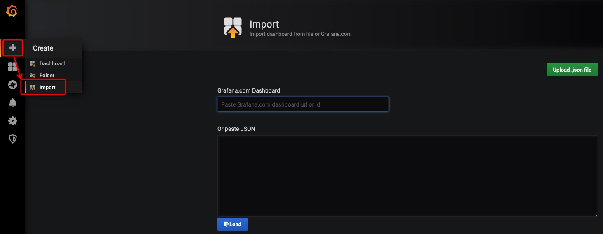

# Crypto.com Chain Grafana Dashboard

A [Grafana](https://grafana.com/) dashboard compatible with crypto.com chain

## Preview


## How To

We assume that you already have [Grafana](https://grafana.com/) and [Prometheus](https://prometheus.io/) installed.

### Enable Tendermint Metrics

```bash
sed -i 's/prometheus = false/prometheus = true/g' <YOUR-NODE-HOMEDIR>/config/config.toml
```

After restarting your node, you should be able to access the tendermint metrics(default port is 26660): <http://localhost:26660>

### Configure Prometheus Targets

Append a `job` under the `scrape_configs` of your prometheus.yml

```yaml
      - job_name: cryptocom
        static_configs:
        - targets: ['<Validator-IP>:26660']
          labels:
            instance: validator
        - targets: ['<Sentry-0-IP>:26660']
          labels:
            instance: sentry-0
        - targets: ['<Sentry-1-IP>:26660']
          labels:
            instance: sentry-1
```

Reload prometheus config

```bash
curl -X POST http://<PROMETHEUS-IP>:9090/-/reload
```

### Import Grafana Dashboard


